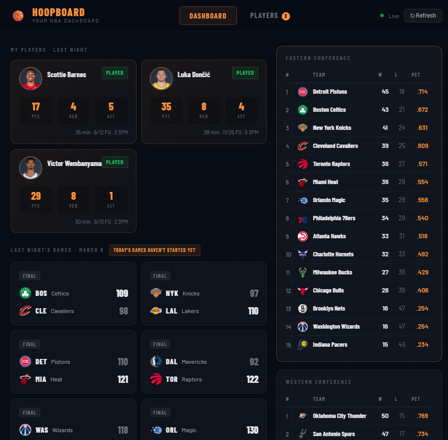

## Hoopboard
<div align="center">

 
**Your daily NBA dashboard — live scores, box scores, standings, and player tracking, all in one place.**
 


 Hoopboard lets you track the performances of your favourite NBA players from a simple dashboard. Check today's scores, browse live quarter-by-quarter updates, search any player, and build a personal favourites list so you can instantly see how your favourite players performed.

 
</div>

## Setup

### 1. Create and activate a virtual environment
```  
python -m venv venv
source venv/bin/activate        # Mac/Linux
venv\Scripts\activate           # Windows
```

### 2. Install dependencies
```
pip install -r requirements.txt
```

### 3. Run the server
Open a terminal in /api and run the following command for the backend:
```
python run.py
```  
Server starts at **http://localhost:5000**

Open a terminal in /ui and run the following command for the frontend:
```
npm run dev
```

---

## API Reference

| Method | Endpoint | Description |
|--------|----------|-------------|
| GET | `/api/games/today` | All games today (scores, status, live quarter) |      
| GET | `/api/games/standings` | East + West conference standings |
| GET | `/api/players/search?q=` | Search players by name |
| GET | `/api/players/<nba_id>` | Player bio + season averages |
| GET | `/api/players/<nba_id>/stats/today` | Today's game stats (or `{played: false}`) |
| GET | `/api/favourites/` | List all favourited players |
| POST | `/api/favourites/` | Add a player to favourites |
| DELETE | `/api/favourites/<nba_id>` | Remove a player from favourites |
| GET | `/api/dashboard/` | All dashboard data in one request |

### POST /api/favourites/ — Request Body
```json
{
  "nba_id": 2544,
  "name": "LeBron James",
  "team": "LAL",
  "position": "SF"
}
```

---

## Notes
- Database is SQLite (`hoopboard.db`), auto-created on first run. No setup needed.
- `nba_api` calls are rate-limited by the NBA. The dashboard endpoint batches requests for all favourited players — keep favourites list reasonable (< 15 players) to avoid timeouts.
- CORS is configured for `http://localhost:5173` (Vite default). Change in `app.py` if needed.        
